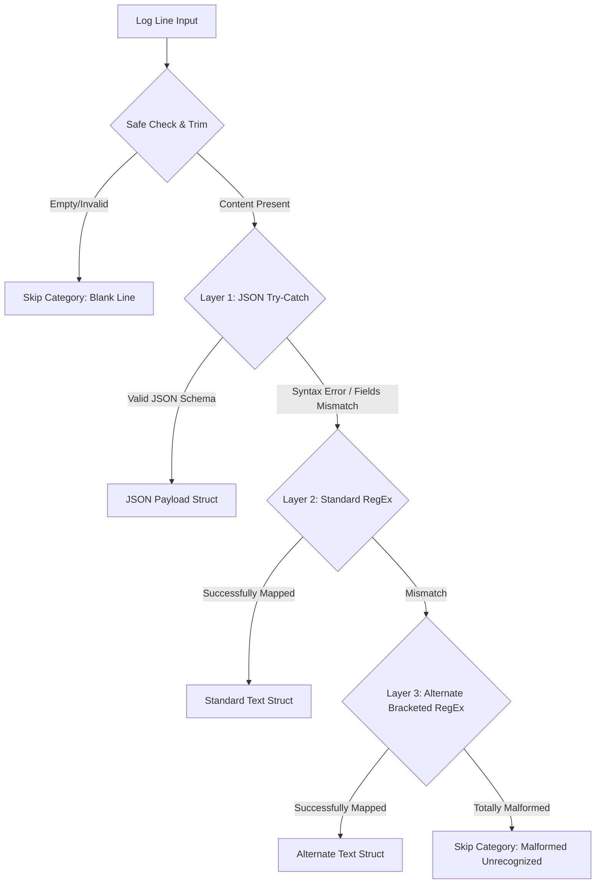

# Log Analyzer Architecture and Answers

This document details the architectural decisions, design defenses, and reliability assurances engineered into this CLI Log Analyzer.

---

## 1. Architectural Decisions & "Useful Output" Defense

For a systems engineer or on-call engineer, **perfect logs do not exist, and alert fatigue is dangerous.** Therefore, when building a log analysis utility, simple dump-outs or crashing runs are unacceptable.

We designed a **rich, multi-dimensional terminal dashboard** organized in discrete diagnostic segments:
* **System Audit Profile**: Displays the overall parsing sanity rate (valid vs gracefully-skipped noise). Crucially, we categorise malformed drops (java/node stack trace lines, empty frames, system exception warnings) so that engineers can quickly spot systemic configuration changes or logging errors.
* **Service Health & Severity Charts**: Breaks down HTTP status codes into 1xx, 2xx, 3xx, 4xx, 5xx alongside an aggregate **Error Rate** metrics. This instantly informs engineers if there's a live outage (high 5xx codes).
* **Performance Diagnostics (Latency)**: Tracks averages, minimums, and absolute maximums.
* **Bottleneck Profiler**: Ranks endpoints by their **consistently slow average latency** instead of just absolute worst-case times (which are often anomalous outliers caused by cold starts). This highlights actual code paths that require developer optimization.
* **Engagement Insights**: Maps top Client IPs and top Visited paths to recognize malicious scanners, bots, or hot routes.

---

## 2. Defensive Processing & Layered Design

To guarantee complete immunity to runtime exceptions, the parser implements a robust **Layered Resilience Strategy**:



### Crash-Resilient Parsing Design
1. **Sanitization Wrappers**: Every entry point is wrapped in standard JavaScript `try / catch` bounds, catching structural JSON parsing syntax exceptions, regex matching malfunctions, or parameter type errors. The parser **never throws** or interrupts the application pipeline.
2. **Defensive Suffix Anchor Regex**: Standard log components (`[IP] [Method] [Path] [Status] [ResponseTime]`) are validated using backward matching from the end of the text line. This design is immune to:
   - Dynamic variations in whitespace/tabs.
   - Internal spaces inside timestamps (e.g. `2024/03/15 14:23:01`).
   - Custom trailed additions (referrers, user agents in quotes) because of an optional wildcard anchor capture segment: `(?:\s+(.*))?`.

---

## 3. High Performance Streaming (Constant Memory)

A weak submission would load log files directly using `fs.readFileSync()`, which crashes the V8 heap on log files exceeding a few gigabytes (e.g., hundreds of thousands of lines).

### $O(1)$ Space Complexity Strategy
Our CLI tool `logAnalyzer.js` uses standard **Node.js Read Streams** combined with the core `readline` interface:
```javascript
const fileStream = fs.createReadStream(resolvedPath);
const rl = readline.createInterface({
  input: fileStream,
  crlfDelay: Infinity
});
```

* **Line-by-Line Execution**: Readline buffers logs block-by-block and issues a line event. The memory profile remains constant (at under `30MB` RAM) whether processing a 1,000-line sample or a 1,000,000-line production audit.
* **Incremental Aggregation**: Statistics (sums, counts, hits maps) are computed on-the-fly inside the event loop, ensuring optimal garbage collection efficiency.
